# OpenAI API Choreography Atlas

Last updated: April 25, 2026.

This document is a diagram-first map of how the current OpenAI API surfaces
work, how Codex uses them in practice, and where `llama_shim` intentionally
implements a broad local subset rather than exact hosted parity.

It is an engineering aid, not a new compatibility claim. The source of truth
for status labels remains [compatibility-matrix.md](../compatibility-matrix.md).

## Source Basis

Checked against the local official-docs index at `openapi/llms.txt`, OpenAI
Docs MCP, and the current official pages for:

- [Migrate to the Responses API](https://developers.openai.com/api/docs/guides/migrate-to-responses)
- [Conversation state](https://developers.openai.com/api/docs/guides/conversation-state)
- [Streaming API responses](https://developers.openai.com/api/docs/guides/streaming-responses)
- [WebSocket Mode](https://developers.openai.com/api/docs/guides/websocket-mode)
- [Compaction](https://developers.openai.com/api/docs/guides/compaction)
- [Retrieval](https://developers.openai.com/api/docs/guides/retrieval)
- [File search](https://developers.openai.com/api/docs/guides/tools-file-search)
- [Web search](https://developers.openai.com/api/docs/guides/tools-web-search)
- [Image generation](https://developers.openai.com/api/docs/guides/image-generation)
- [Computer use](https://developers.openai.com/api/docs/guides/tools-computer-use)
- [Code Interpreter](https://developers.openai.com/api/docs/guides/tools-code-interpreter)
- [MCP and Connectors](https://developers.openai.com/api/docs/guides/tools-connectors-mcp)
- [Shell](https://developers.openai.com/api/docs/guides/tools-shell)
- [Apply Patch](https://developers.openai.com/api/docs/guides/tools-apply-patch)
- [Tool search](https://developers.openai.com/api/docs/guides/tools-tool-search)
- [Codex configuration reference](https://developers.openai.com/codex/config-reference)

## Status Legend

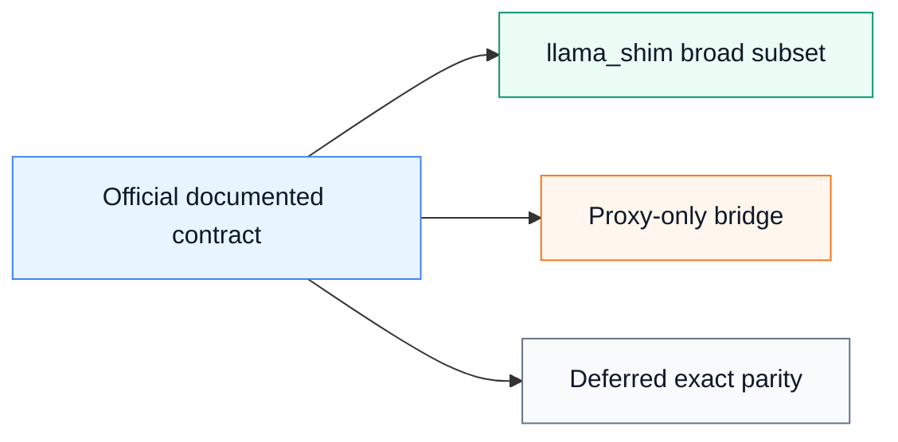
```mermaid
flowchart LR
  official["Official documented contract"]
  shim["llama_shim broad subset"]
  proxy["Proxy-only bridge"]
  deferred["Deferred exact parity"]

  official --> shim
  official --> proxy
  official --> deferred

  classDef official fill:#e8f4ff,stroke:#3b82f6,color:#0f172a
  classDef shim fill:#ecfdf5,stroke:#059669,color:#0f172a
  classDef proxy fill:#fff7ed,stroke:#f97316,color:#0f172a
  classDef deferred fill:#f8fafc,stroke:#64748b,color:#0f172a
  class official official
  class shim shim
  class proxy proxy
  class deferred deferred
```

`Broad subset` is a good label when the route or tool is usable and tested, but
the shim does not claim hosted orchestration, hosted encrypted payloads, exact
event timing, or every edge-case schema behavior.

## Coverage Boundary

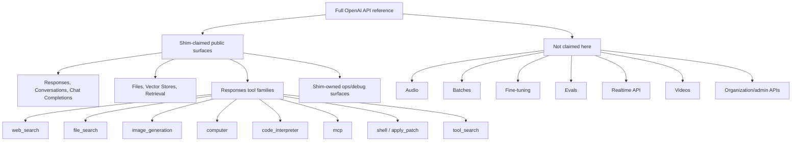
```mermaid
flowchart TB
  openai["Full OpenAI API reference"]
  shimClaimed["Shim-claimed public surfaces"]
  responses["Responses, Conversations, Chat Completions"]
  retrieval["Files, Vector Stores, Retrieval"]
  tools["Responses tool families"]
  ops["Shim-owned ops/debug surfaces"]
  outOfScope["Not claimed here"]

  openai --> shimClaimed
  openai --> outOfScope
  shimClaimed --> responses
  shimClaimed --> retrieval
  shimClaimed --> tools
  shimClaimed --> ops

  tools --> webSearch["web_search"]
  tools --> fileSearch["file_search"]
  tools --> imageGen["image_generation"]
  tools --> computer["computer"]
  tools --> codeInterpreter["code_interpreter"]
  tools --> mcp["mcp"]
  tools --> coding["shell / apply_patch"]
  tools --> toolSearch["tool_search"]

  outOfScope --> audio["Audio"]
  outOfScope --> batches["Batches"]
  outOfScope --> fineTuning["Fine-tuning"]
  outOfScope --> evals["Evals"]
  outOfScope --> realtime["Realtime API"]
  outOfScope --> videos["Videos"]
  outOfScope --> orgAdmin["Organization/admin APIs"]
```

This atlas covers the API surfaces that `llama_shim` currently claims or
intentionally stages. It is not a diagram of every endpoint in the OpenAI API
reference.

## 1. Surface Map

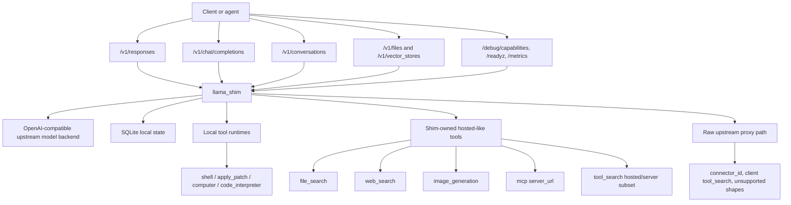
```mermaid
flowchart TB
  client["Client or agent"]
  shim["llama_shim"]
  upstream["OpenAI-compatible upstream model backend"]
  store["SQLite local state"]
  localTools["Local tool runtimes"]
  hostedLike["Shim-owned hosted-like tools"]
  proxy["Raw upstream proxy path"]

  client --> responses["/v1/responses"]
  client --> chat["/v1/chat/completions"]
  client --> conversations["/v1/conversations"]
  client --> files["/v1/files and /v1/vector_stores"]
  client --> ops["/debug/capabilities, /readyz, /metrics"]

  responses --> shim
  chat --> shim
  conversations --> shim
  files --> shim
  ops --> shim

  shim --> store
  shim --> upstream
  shim --> localTools
  shim --> hostedLike
  shim --> proxy

  localTools --> shell["shell / apply_patch / computer / code_interpreter"]
  hostedLike --> rag["file_search"]
  hostedLike --> web["web_search"]
  hostedLike --> image["image_generation"]
  hostedLike --> mcp["mcp server_url"]
  hostedLike --> toolSearch["tool_search hosted/server subset"]

  proxy --> upstreamOnly["connector_id, client tool_search, unsupported shapes"]
```

What exists today:

- HTTP Responses is the primary local stateful surface.
- WebSocket is a transport adapter for the same current local Responses subset.
- Chat Completions remains both a public compatibility surface and the internal
  model call used by many local tool planners.
- `/debug/capabilities` is the operator-visible truth for active local runtime
  capabilities.

## Chat Completions Compatibility

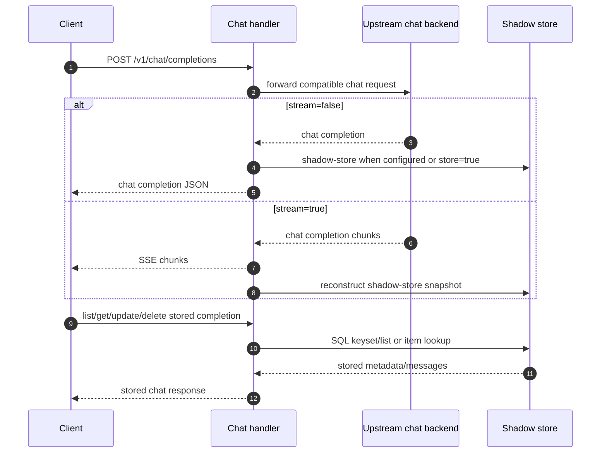
```mermaid
sequenceDiagram
  autonumber
  participant C as Client
  participant H as Chat handler
  participant U as Upstream chat backend
  participant DB as Shadow store

  C->>H: POST /v1/chat/completions
  H->>U: forward compatible chat request
  alt stream=false
    U-->>H: chat completion
    H->>DB: shadow-store when configured or store=true
    H-->>C: chat completion JSON
  else stream=true
    U-->>H: chat completion chunks
    H-->>C: SSE chunks
    H->>DB: reconstruct shadow-store snapshot
  end
  C->>H: list/get/update/delete stored completion
  H->>DB: SQL keyset/list or item lookup
  DB-->>H: stored metadata/messages
  H-->>C: stored chat response
```

Official context:

- Chat Completions remains an OpenAI API surface, but the migration guide
  points new agentic/tooling work toward Responses.
- The OpenAI API reference includes stored chat completion retrieval and message
  listing endpoints.

Shim reality:

- Chat Completions is a compatibility surface and an internal planner/model
  transport.
- Stored chat ownership is local shadow-store first, with optional upstream
  bridge behavior.
- Streamed completions are reconstructed into local stored snapshots.

## 2. HTTP Non-Stream Response

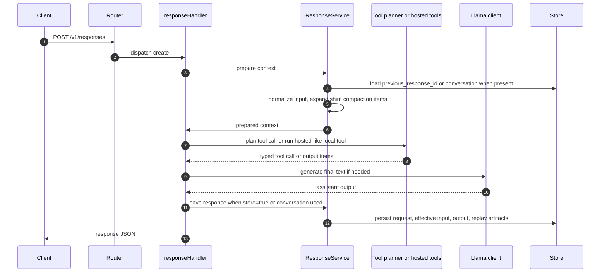
```mermaid
sequenceDiagram
  autonumber
  participant C as Client
  participant R as Router
  participant H as responseHandler
  participant S as ResponseService
  participant T as Tool planner or hosted tools
  participant L as Llama client
  participant DB as Store

  C->>R: POST /v1/responses
  R->>H: dispatch create
  H->>S: prepare context
  S->>DB: load previous_response_id or conversation when present
  S->>S: normalize input, expand shim compaction items
  S->>H: prepared context
  H->>T: plan tool call or run hosted-like local tool
  T-->>H: typed tool call or output items
  H->>L: generate final text if needed
  L-->>H: assistant output
  H->>S: save response when store=true or conversation used
  S->>DB: persist request, effective input, output, replay artifacts
  H-->>C: response JSON
```

Important reality:

- `previous_response_id` and `conversation` are mutually exclusive.
- Stored state uses effective input snapshots so follow-up turns can be rebuilt
  locally.
- Unsupported shapes go to upstream in `prefer_local` only when there is no
  active shim-owned state that forces local handling.

## 3. Conversation State Choices

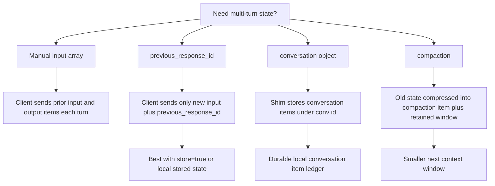
```mermaid
flowchart TB
  start["Need multi-turn state?"]
  manual["Manual input array"]
  previous["previous_response_id"]
  conversation["conversation object"]
  compact["compaction"]

  start --> manual
  start --> previous
  start --> conversation
  start --> compact

  manual --> m1["Client sends prior input and output items each turn"]
  previous --> p1["Client sends only new input plus previous_response_id"]
  conversation --> c1["Shim stores conversation items under conv id"]
  compact --> k1["Old state compressed into compaction item plus retained window"]

  p1 --> storeTrue["Best with store=true or local stored state"]
  c1 --> durable["Durable local conversation item ledger"]
  k1 --> smaller["Smaller next context window"]
```

Shim-specific behavior:

- `previous_response_id` lineage is reconstructed from local stored responses.
- Conversation items preserve both response input and response output items.
- Compaction items are shim-owned opaque state, not exact hosted encrypted
  payloads.

## 4. HTTP SSE Event Flow

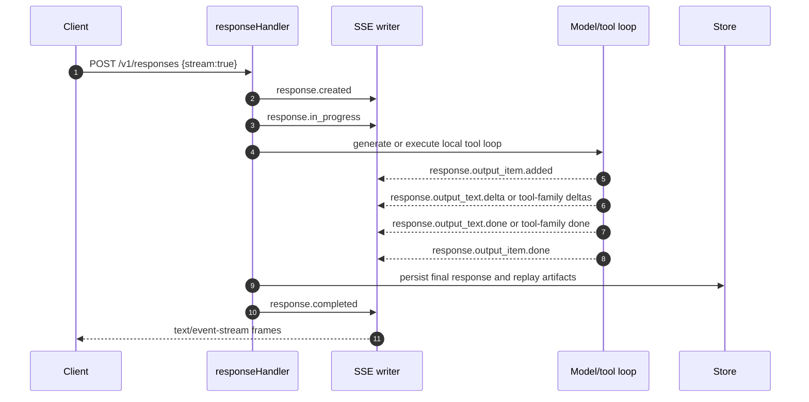
```mermaid
sequenceDiagram
  autonumber
  participant C as Client
  participant H as responseHandler
  participant S as SSE writer
  participant L as Model/tool loop
  participant DB as Store

  C->>H: POST /v1/responses {stream:true}
  H->>S: response.created
  H->>S: response.in_progress
  H->>L: generate or execute local tool loop
  L-->>S: response.output_item.added
  L-->>S: response.output_text.delta or tool-family deltas
  L-->>S: response.output_text.done or tool-family done
  L-->>S: response.output_item.done
  H->>DB: persist final response and replay artifacts
  H->>S: response.completed
  S-->>C: text/event-stream frames
```

OpenAI documents semantic typed events for streaming. The shim has two replay
styles:

- specific typed replay where docs or fixtures justify it, such as first-turn
  local `shell_call` and local `apply_patch_call`
- generic `response.output_item.*` replay where exact hosted choreography is
  unknown or intentionally out of scope

## 5. Stored Retrieve-Stream Replay

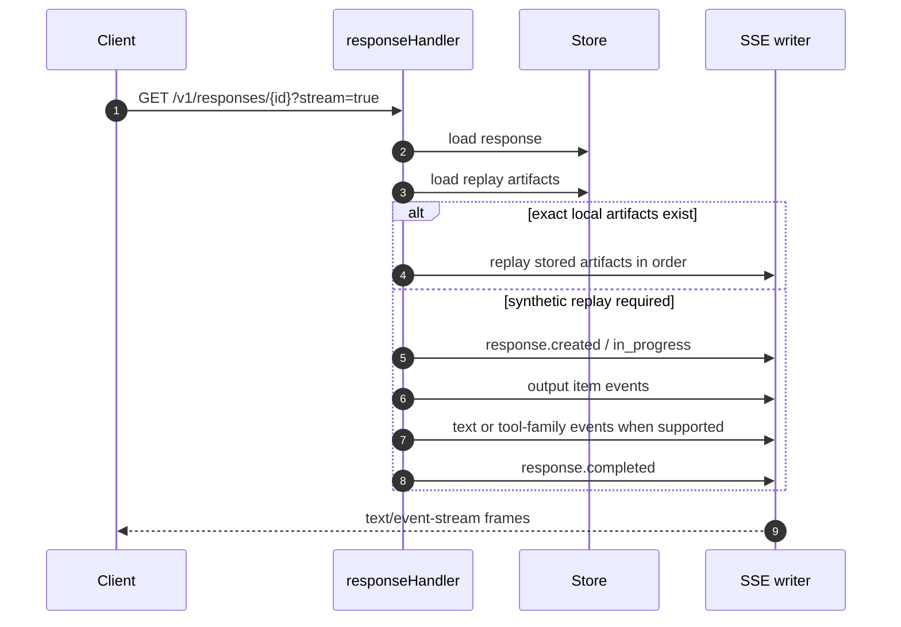
```mermaid
sequenceDiagram
  autonumber
  participant C as Client
  participant H as responseHandler
  participant DB as Store
  participant S as SSE writer

  C->>H: GET /v1/responses/{id}?stream=true
  H->>DB: load response
  H->>DB: load replay artifacts
  alt exact local artifacts exist
    H->>S: replay stored artifacts in order
  else synthetic replay required
    H->>S: response.created / in_progress
    H->>S: output item events
    H->>S: text or tool-family events when supported
    H->>S: response.completed
  end
  S-->>C: text/event-stream frames
```

Current boundary:

- `apply_patch_call` retrieve-stream has fixture-backed typed operation diff
  replay.
- `shell_call` retrieve-stream remains generic because upstream background
  shell replay is still blocked by upstream `server_error` captures.

## 6. Responses WebSocket Mode

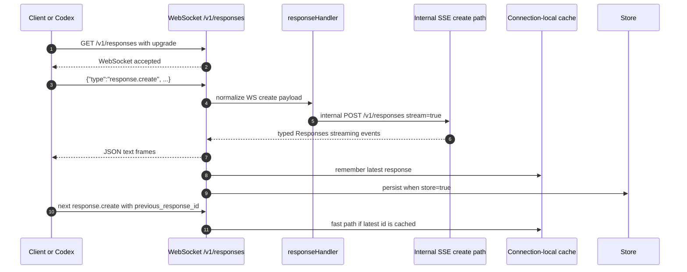
```mermaid
sequenceDiagram
  autonumber
  participant C as Client or Codex
  participant W as WebSocket /v1/responses
  participant H as responseHandler
  participant SSE as Internal SSE create path
  participant Cache as Connection-local cache
  participant DB as Store

  C->>W: GET /v1/responses with upgrade
  W-->>C: WebSocket accepted
  C->>W: {"type":"response.create", ...}
  W->>H: normalize WS create payload
  H->>SSE: internal POST /v1/responses stream=true
  SSE-->>W: typed Responses streaming events
  W-->>C: JSON text frames
  W->>Cache: remember latest response
  W->>DB: persist when store=true
  C->>W: next response.create with previous_response_id
  W->>Cache: fast path if latest id is cached
```

What should be true per official docs:

- WebSocket server events follow the Responses streaming event model.
- A single connection processes one in-flight response at a time.
- No multiplexing.
- `previous_response_id` supports incremental input on the active connection.

What exists in the shim:

- Same local generation path as HTTP/SSE.
- JSON `data:` payloads from SSE are bridged as WebSocket text frames.
- `store=false` continuation works for the most recent response on the same
  socket via connection-local cache.
- Exact hosted close codes, quota semantics, 60-minute enforcement, and upstream
  WebSocket proxying are deferred to V5.

## 7. Generic Tool Loop

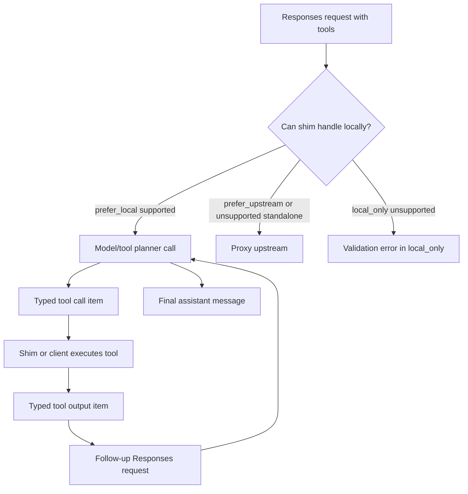
```mermaid
flowchart TB
  request["Responses request with tools"]
  route{"Can shim handle locally?"}
  planner["Model/tool planner call"]
  localCall["Typed tool call item"]
  execute["Shim or client executes tool"]
  output["Typed tool output item"]
  followup["Follow-up Responses request"]
  final["Final assistant message"]
  upstream["Proxy upstream"]
  reject["Validation error in local_only"]

  request --> route
  route -->|prefer_local supported| planner
  route -->|prefer_upstream or unsupported standalone| upstream
  route -->|local_only unsupported| reject
  planner --> localCall
  localCall --> execute
  execute --> output
  output --> followup
  followup --> planner
  planner --> final
```

This pattern applies to custom functions, remote MCP, coding tools, tool
search, and several hosted-like local tools. The exact item names differ by
tool family.

## 7.1 Constrained Decoding Runtime

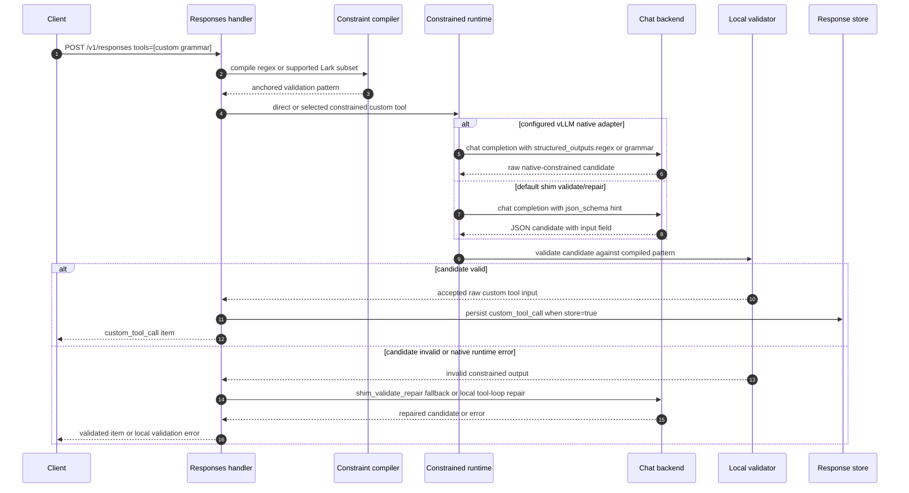
```mermaid
sequenceDiagram
  autonumber
  participant C as Client
  participant R as Responses handler
  participant K as Constraint compiler
  participant CR as Constrained runtime
  participant M as Chat backend
  participant V as Local validator
  participant S as Response store

  C->>R: POST /v1/responses tools=[custom grammar]
  R->>K: compile regex or supported Lark subset
  K-->>R: anchored validation pattern
  R->>CR: direct or selected constrained custom tool
  alt configured vLLM native adapter
    CR->>M: chat completion with structured_outputs.regex or grammar
    M-->>CR: raw native-constrained candidate
  else default shim validate/repair
    CR->>M: chat completion with json_schema hint
    M-->>CR: JSON candidate with input field
  end
  CR->>V: validate candidate against compiled pattern
  alt candidate valid
    V-->>R: accepted raw custom tool input
    R->>S: persist custom_tool_call when store=true
    R-->>C: custom_tool_call item
  else candidate invalid or native runtime error
    V-->>R: invalid constrained output
    R->>M: shim_validate_repair fallback or local tool-loop repair
    M-->>R: repaired candidate or error
    R-->>C: validated item or local validation error
  end
```

What exists in the shim:

- `grammar.regex` and a supported Lark subset compile to a local validation
  pattern.
- The backend receives a structured-output hint, but the shim does not treat
  that as proof of native constrained sampling.
- `/debug/capabilities.runtime.constrained_decoding` reports
  `support=shim_validate_repair`, `capability_class=none`, and
  `native_available=false` by default.
- With `responses.constrained_decoding.backend=vllm`, the shim uses
  `structured_outputs.regex` for regex grammars and
  `structured_outputs.grammar` for the shim-supported Lark subset, reporting
  `capability_class=grammar_native`.
- The vLLM adapter is registered behind the constrained runtime adapter
  registry. Invalid native output, native timeouts, and native upstream errors
  retry through the default shim validate/repair runtime before route-level
  upstream fallback is considered.
- Future backend-specific adapters must change those capability fields before
  docs can claim `json_schema_native` or broader grammar parity.

## 8. Retrieval, Vector Stores, And File Search

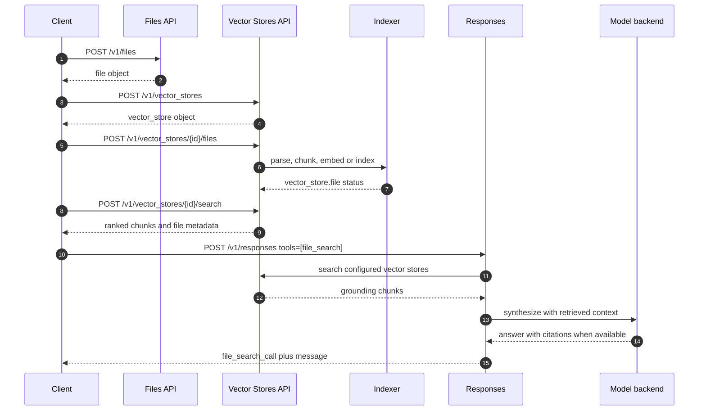
```mermaid
sequenceDiagram
  autonumber
  participant C as Client
  participant F as Files API
  participant V as Vector Stores API
  participant I as Indexer
  participant R as Responses
  participant M as Model backend

  C->>F: POST /v1/files
  F-->>C: file object
  C->>V: POST /v1/vector_stores
  V-->>C: vector_store object
  C->>V: POST /v1/vector_stores/{id}/files
  V->>I: parse, chunk, embed or index
  I-->>V: vector_store.file status
  C->>V: POST /v1/vector_stores/{id}/search
  V-->>C: ranked chunks and file metadata
  C->>R: POST /v1/responses tools=[file_search]
  R->>V: search configured vector stores
  V-->>R: grounding chunks
  R->>M: synthesize with retrieved context
  M-->>R: answer with citations when available
  R-->>C: file_search_call plus message
```

Official contract:

- File search is a Responses tool over vector stores.
- Vector store files are parsed, chunked, embedded, and indexed.
- Direct vector-store search can return ranked chunks and file metadata.
- `include=["file_search_call.results"]` exposes search results in the
  response.

Shim reality:

- `/v1/files`, `/v1/vector_stores`, vector-store files, and vector-store search
  are local-first.
- Durable retrieval object storage is currently `storage.backend=sqlite`; V3
  backend expansion is tracked in
  [v3-storage-retrieval-backends.md](../v3-storage-retrieval-backends.md).
- Lexical search is the default local substrate; semantic and hybrid paths
  depend on configured retrieval indexing.
- Local `file_search` injects bounded grounding context before final answer
  generation.
- Hosted ranking quality, billing semantics, and exact citation placement are
  not claimed.

## 9. Web Search

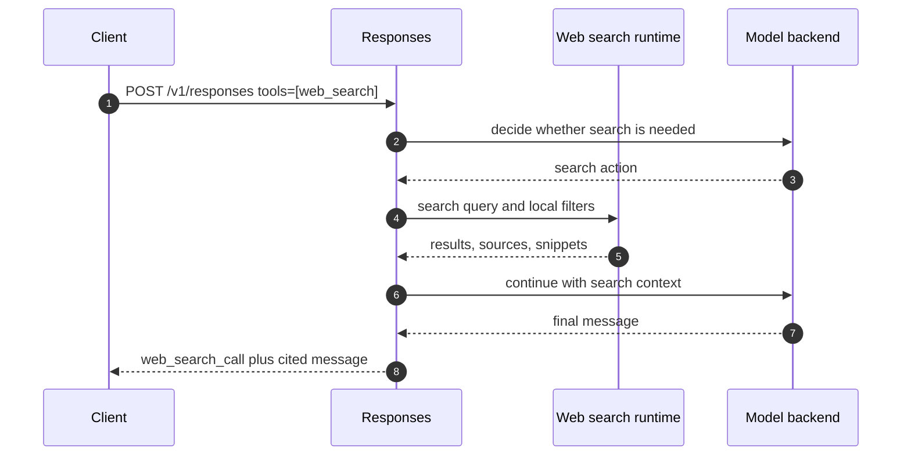
```mermaid
sequenceDiagram
  autonumber
  participant C as Client
  participant R as Responses
  participant W as Web search runtime
  participant M as Model backend

  C->>R: POST /v1/responses tools=[web_search]
  R->>M: decide whether search is needed
  M-->>R: search action
  R->>W: search query and local filters
  W-->>R: results, sources, snippets
  R->>M: continue with search context
  M-->>R: final message
  R-->>C: web_search_call plus cited message
```

Official contract:

- Web search returns a `web_search_call` and a message with URL citation
  annotations.
- Search actions can include `search`, and reasoning models may use
  `open_page` or `find_in_page`.
- `web_search` supports domain filters, sources, user location, and live access
  controls; `web_search_preview` ignores `external_web_access`.

Shim reality:

- The local runtime is SearXNG-backed when configured.
- The local subset supports practical filters, source inclusion, and preview
  compatibility behavior.
- Exact hosted search ranking, third-party feed behavior, and reasoning-model
  browsing depth are not claimed.

## 10. Image Generation

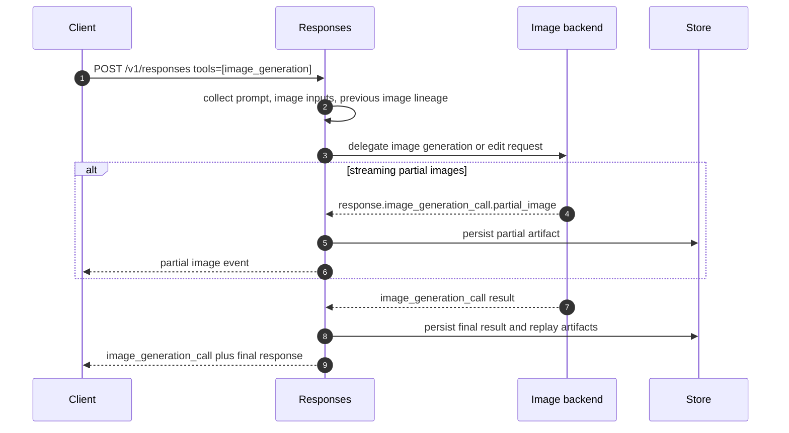
```mermaid
sequenceDiagram
  autonumber
  participant C as Client
  participant R as Responses
  participant B as Image backend
  participant DB as Store

  C->>R: POST /v1/responses tools=[image_generation]
  R->>R: collect prompt, image inputs, previous image lineage
  R->>B: delegate image generation or edit request
  alt streaming partial images
    B-->>R: response.image_generation_call.partial_image
    R->>DB: persist partial artifact
    R-->>C: partial image event
  end
  B-->>R: image_generation_call result
  R->>DB: persist final result and replay artifacts
  R-->>C: image_generation_call plus final response
```

Official contract:

- Image generation can be used through the Images API or as a Responses
  `image_generation` tool.
- Responses image generation supports multi-turn editing through
  `previous_response_id` or by passing prior image generation calls in context.
- Streaming can emit `response.image_generation_call.partial_image` events.

Shim reality:

- The shim keeps the outer Responses object, local state, storage, and replay.
- Actual image work is delegated to a Responses-compatible image backend.
- Current-turn image inputs and edit lineage are flattened into shim-owned
  backend input.
- Exact hosted planner decisions, partial-image timing, and richer hosted
  failure choreography are not claimed.

## 11. Computer Use

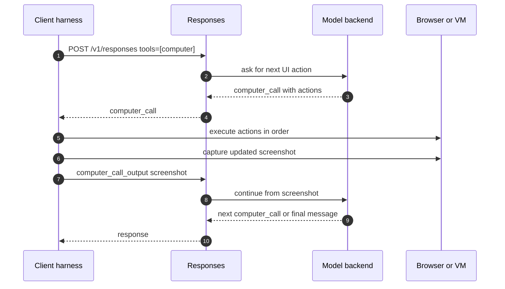
```mermaid
sequenceDiagram
  autonumber
  participant C as Client harness
  participant R as Responses
  participant M as Model backend
  participant UI as Browser or VM

  C->>R: POST /v1/responses tools=[computer]
  R->>M: ask for next UI action
  M-->>R: computer_call with actions
  R-->>C: computer_call
  C->>UI: execute actions in order
  C->>UI: capture updated screenshot
  C->>R: computer_call_output screenshot
  R->>M: continue from screenshot
  M-->>R: next computer_call or final message
  R-->>C: response
```

Official contract:

- The built-in computer loop is screenshot driven.
- The harness executes returned actions and sends back
  `computer_call_output`.
- The loop repeats until the model stops returning `computer_call`.
- High-impact actions require a human-in-the-loop policy in the application.

Shim reality:

- The local subset is screenshot-first and planner-backed.
- The shim preserves typed `computer_call` and `computer_call_output` items in
  stored response and input item surfaces.
- Exact hosted `response.computer_call.*` SSE choreography is not claimed.

## 12. Code Interpreter

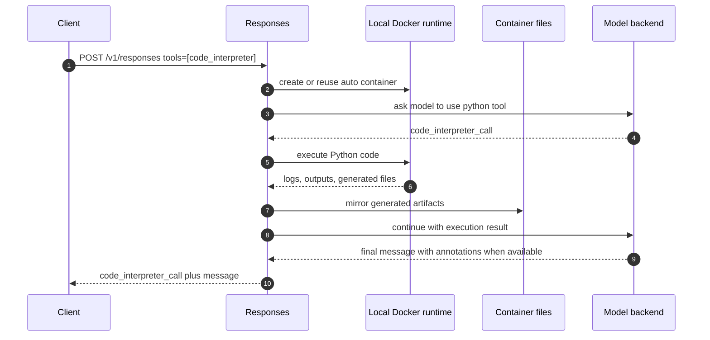
```mermaid
sequenceDiagram
  autonumber
  participant C as Client
  participant R as Responses
  participant CI as Local Docker runtime
  participant CF as Container files
  participant M as Model backend

  C->>R: POST /v1/responses tools=[code_interpreter]
  R->>CI: create or reuse auto container
  R->>M: ask model to use python tool
  M-->>R: code_interpreter_call
  R->>CI: execute Python code
  CI-->>R: logs, outputs, generated files
  R->>CF: mirror generated artifacts
  R->>M: continue with execution result
  M-->>R: final message with annotations when available
  R-->>C: code_interpreter_call plus message
```

Official contract:

- Code Interpreter runs Python in a sandboxed container.
- Containers can be auto-created or explicitly created through
  `/v1/containers`.
- Generated files can appear as `container_file_citation` annotations.

Shim reality:

- The current local execution boundary is Docker.
- Shim-local Responses accepts `container: {"type":"auto"}` for execution;
  explicit hosted-style container ids are not part of the local execution
  subset.
- `/v1/containers` exists for shim-managed container state and files.
- `include=["code_interpreter_call.outputs"]` is a logs-only practical subset.
- Exact hosted artifact placement, status transitions, and rich failure
  fidelity are not claimed.

## 13. Remote MCP And Connectors

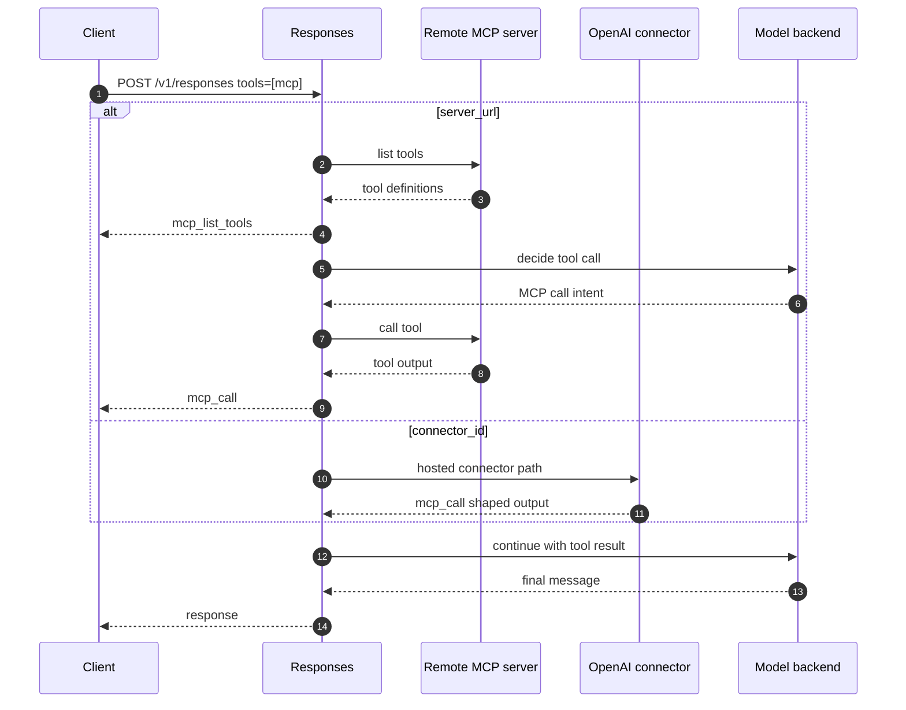
```mermaid
sequenceDiagram
  autonumber
  participant C as Client
  participant R as Responses
  participant MCP as Remote MCP server
  participant Conn as OpenAI connector
  participant M as Model backend

  C->>R: POST /v1/responses tools=[mcp]
  alt server_url
    R->>MCP: list tools
    MCP-->>R: tool definitions
    R-->>C: mcp_list_tools
    R->>M: decide tool call
    M-->>R: MCP call intent
    R->>MCP: call tool
    MCP-->>R: tool output
    R-->>C: mcp_call
  else connector_id
    R->>Conn: hosted connector path
    Conn-->>R: mcp_call shaped output
  end
  R->>M: continue with tool result
  M-->>R: final message
  R-->>C: response
```

Official contract:

- `mcp` supports remote MCP servers with `server_url` and OpenAI-maintained
  connectors with `connector_id`.
- The model may first list tools, producing `mcp_list_tools`.
- Tool execution produces `mcp_call`; approval-required flows can produce
  `mcp_approval_request` and accept `mcp_approval_response`.
- Authorization values are not stored and must be supplied again when needed.

Shim reality:

- Remote `mcp.server_url` has a local subset.
- `mcp.connector_id` is a proxy-only compatibility bridge, not a local
  connector runtime.
- Cached `mcp_list_tools` follow-up is supported in the local subset.
- Exact hosted connector behavior and approval edge cases remain conservative.

## 14. Native Coding Tools

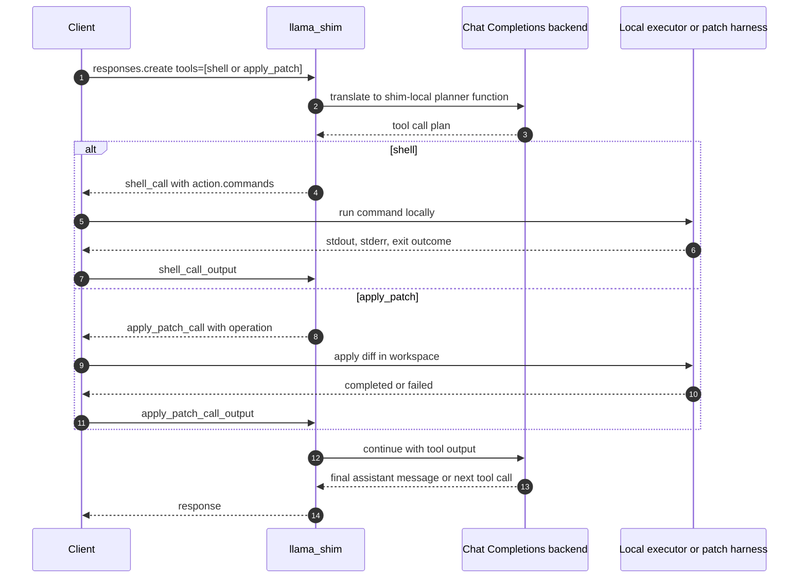
```mermaid
sequenceDiagram
  autonumber
  participant C as Client
  participant Shim as llama_shim
  participant M as Chat Completions backend
  participant Exec as Local executor or patch harness

  C->>Shim: responses.create tools=[shell or apply_patch]
  Shim->>M: translate to shim-local planner function
  M-->>Shim: tool call plan
  alt shell
    Shim-->>C: shell_call with action.commands
    C->>Exec: run command locally
    Exec-->>C: stdout, stderr, exit outcome
    C->>Shim: shell_call_output
  else apply_patch
    Shim-->>C: apply_patch_call with operation
    C->>Exec: apply diff in workspace
    Exec-->>C: completed or failed
    C->>Shim: apply_patch_call_output
  end
  Shim->>M: continue with tool output
  M-->>Shim: final assistant message or next tool call
  Shim-->>C: response
```

Official contract:

- `shell` emits `shell_call`; client/local runtime returns
  `shell_call_output`.
- `apply_patch` emits `apply_patch_call`; patch harness returns
  `apply_patch_call_output`.

Shim reality:

- Native local declarations are accepted as broad local subsets.
- The current public Codex CLI smokes exercise function-tool bridge paths
  (`exec_command`, fallback `shell`) rather than proving Codex emits native
  Responses `shell` or `apply_patch` declarations.
- The shim still supports native declarations for clients that send them.

## 15. Coding Tool SSE Families

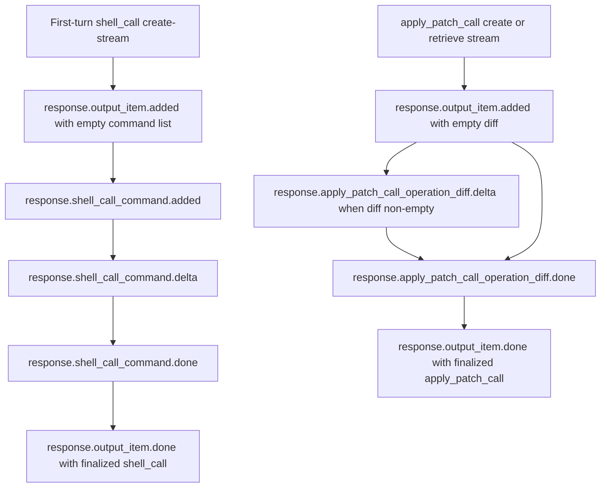
```mermaid
flowchart TB
  shellCreate["First-turn shell_call create-stream"]
  shellAdded["response.output_item.added with empty command list"]
  shellCmdAdded["response.shell_call_command.added"]
  shellDelta["response.shell_call_command.delta"]
  shellDone["response.shell_call_command.done"]
  shellItemDone["response.output_item.done with finalized shell_call"]

  patchCreate["apply_patch_call create or retrieve stream"]
  patchAdded["response.output_item.added with empty diff"]
  patchDelta["response.apply_patch_call_operation_diff.delta when diff non-empty"]
  patchDone["response.apply_patch_call_operation_diff.done"]
  patchItemDone["response.output_item.done with finalized apply_patch_call"]

  shellCreate --> shellAdded --> shellCmdAdded --> shellDelta --> shellDone --> shellItemDone
  patchCreate --> patchAdded --> patchDelta --> patchDone --> patchItemDone
  patchAdded --> patchDone
```

The `patchAdded --> patchDone` path is intentional: a structured patch
operation may have an empty diff and still needs a `.done` event.

## 16. Hosted/Server Tool Search

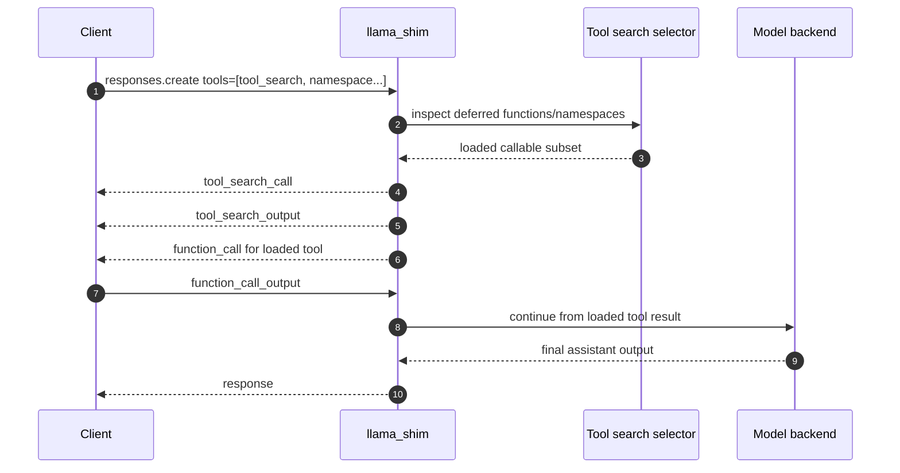
```mermaid
sequenceDiagram
  autonumber
  participant C as Client
  participant Shim as llama_shim
  participant Search as Tool search selector
  participant M as Model backend

  C->>Shim: responses.create tools=[tool_search, namespace...]
  Shim->>Search: inspect deferred functions/namespaces
  Search-->>Shim: loaded callable subset
  Shim-->>C: tool_search_call
  Shim-->>C: tool_search_output
  Shim-->>C: function_call for loaded tool
  C->>Shim: function_call_output
  Shim->>M: continue from loaded tool result
  M-->>Shim: final assistant output
  Shim-->>C: response
```

Official docs describe hosted/server `tool_search` as a way to load deferred
tools before the eventual function call. The shim implements a local hosted-like
subset for declared namespaces and deferred top-level functions. Client-side
tool search remains proxy-only.

## 17. Compaction Choreography

```mermaid
flowchart TB
  long["Long context window"]
  standalone["POST /v1/responses/compact"]
  serverSide["responses.create with context_management compact_threshold"]
  compacted["Canonical next window"]
  response["Normal response output"]
  retained["Retained recent items"]
  opaque["Opaque compaction item"]
  next["Next /v1/responses call"]

  long --> standalone
  long --> serverSide
  standalone --> retained
  standalone --> opaque
  retained --> compacted
  opaque --> compacted
  compacted --> next
  serverSide --> opaque
  serverSide --> response
  response --> next
```

Official behavior:

- Standalone `/responses/compact` returns the canonical next input window.
- That window can include retained prior items plus an opaque compaction item.
- Server-side compaction runs during normal generation when the threshold is
  crossed.

Shim reality:

- `heuristic` returns a single shim-owned compaction item.
- `model_assisted_text` standalone compaction returns retained recent items plus
  a shim-owned compaction item.
- Automatic compaction prefixes the response with one compaction item that can
  rebuild local effective context.

## 18. Codex CLI Through The Shim

```mermaid
sequenceDiagram
  autonumber
  participant User
  participant Codex as Codex CLI
  participant Shim as llama_shim
  participant WS as Responses WebSocket
  participant HTTP as HTTP/SSE fallback
  participant Fixture as Devstack fixture or model backend
  participant Tools as Local command tools

  User->>Codex: codex exec task
  Codex->>Shim: openai_base_url points to shim
  Codex->>WS: GET /v1/responses upgrade when provider supports WS
  alt WebSocket enabled
    WS->>Shim: response.create frames
  else WebSocket unavailable
    Codex->>HTTP: POST /v1/responses
  end
  Shim->>Fixture: Chat Completions planner/model call
  Fixture-->>Shim: function tool call such as exec_command
  Shim-->>Codex: tool call item
  Codex->>Tools: run command or patch locally under Codex policy
  Tools-->>Codex: tool output
  Codex->>Shim: tool output follow-up
  Shim->>Fixture: final continuation
  Fixture-->>Shim: final assistant message
  Shim-->>Codex: response completed
```

Practical finding:

- Codex compatibility is real through `openai_base_url` and the function-tool
  bridge.
- The repo-owned Codex smokes verify WebSocket availability, `exec_command`,
  fallback function `shell`, and a deterministic task matrix.
- They do not prove that current Codex emits native Responses `shell` or
  `apply_patch` declarations.
- Practical model/provider quality is tracked separately in
  [Codex Upstream Model Matrix](codex-upstream-model-matrix.md); those ratings
  are smoke-test guidance, not OpenAI wire-contract claims.

## 19. Routing Modes

```mermaid
flowchart TB
  req["Incoming /v1/responses request"]
  mode{"responses.mode"}
  localState{"References local state?"}
  localSupported{"Local subset supports request?"}
  upstream["Proxy upstream"]
  local["Handle locally"]
  reject["Reject with validation/runtime error"]

  req --> mode
  mode -->|prefer_local| localSupported
  localSupported -->|yes| local
  localSupported -->|no| localState
  localState -->|yes| reject
  localState -->|no| upstream

  mode -->|prefer_upstream| localState
  localState -->|yes| local
  localState -->|no| upstream

  mode -->|local_only| localSupported
  localSupported -->|yes| local
  localSupported -->|no| reject
```

This is why `prefer_upstream` is not a hosted parity guarantee. It is a
proxy-first escape hatch unless the request depends on shim-owned local state.

## 20. Storage And Replay Ownership

```mermaid
flowchart LR
  request["Request JSON"]
  normalized["Normalized input items"]
  effective["Effective input after state rebuild and compaction expansion"]
  output["Output items"]
  text["output_text"]
  replay["Replay artifacts"]
  db["SQLite"]
  retrieve["GET /v1/responses/{id}"]
  inputItems["GET /v1/responses/{id}/input_items"]
  stream["GET /v1/responses/{id}?stream=true"]

  request --> db
  normalized --> db
  effective --> db
  output --> db
  text --> db
  replay --> db

  db --> retrieve
  db --> inputItems
  db --> stream
```

Stored state is not just a cache of final text. It is what lets the shim
support:

- `previous_response_id`
- conversation state
- `/input_items`
- retrieve-stream replay
- compaction follow-up
- tool-output follow-up

## 21. What To Improve Next

```mermaid
flowchart TB
  ready["Ready for new V3 work"]
  constrained["V3 constrained runtime slice"]
  backend["V3 backend expansion"]
  parity["V5 exact hosted parity"]
  ops["V4/V3 ops expansion"]

  ready --> constrained
  ready --> backend
  ready --> ops
  ready --> parity

  constrained --> c0["Default: shim_validate_repair + JSON Schema hint"]
  constrained --> c1["Optional: vLLM structured_outputs.regex + grammar"]
  c1 --> c2["Capability: grammar_native for regex + Lark subset"]
  c1 --> c3["Later: SGLang / llama.cpp adapters"]
  backend --> b1["More image, retrieval, storage, or model backends"]
  ops --> o1["Tenanting, dashboards, admin workflows"]
  parity --> p1["Fixture-backed exact SSE/WS/tool choreography"]
```

Recommended next split:

- V3: features that improve local capability and backend diversity.
- V4: shim-owned extensions, plugin/memory/security architecture.
- V5: exact hosted parity and advanced transport behavior that needs fixtures.

## Quick Read

The current system is good enough to proceed into V3 because:

- the HTTP Responses path is stateful and tested
- SSE and WebSocket share the same local generation path
- native coding tools are usable broad local subsets
- Codex CLI compatibility is verified through real smoke tests
- compaction now has a practical `model_assisted_text` runtime and canonical
  standalone next-window behavior
- exact hosted parity gaps are documented and staged instead of hidden

The important mental model is simple: `llama_shim` is not trying to be hosted
OpenAI infrastructure. It is a local-first compatibility facade with explicit
operator-visible capability boundaries.
