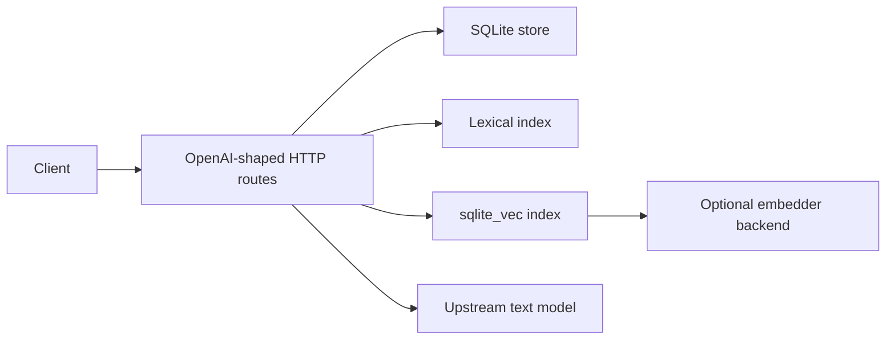
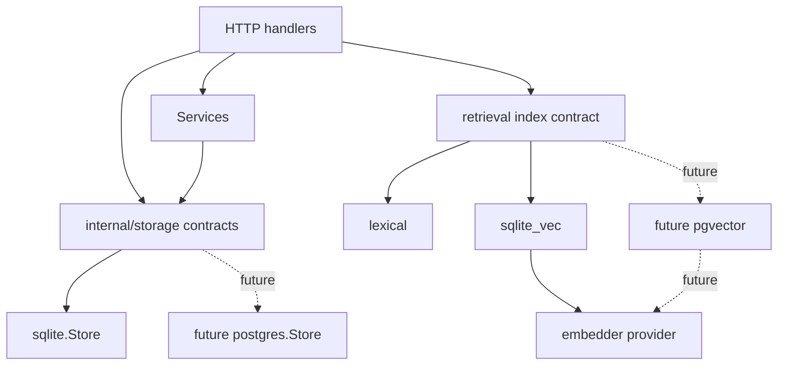

# V3 Storage And Retrieval Backends

Last updated: April 26, 2026.

This is the V3 plan for expanding durable storage and retrieval backends
without changing the public OpenAI-shaped HTTP surface.

Official docs checked for this pass:

- local official-docs index: [openapi/llms.txt](../openapi/llms.txt)
- OpenAI File Search guide:
  <https://developers.openai.com/api/docs/guides/tools-file-search>
- OpenAI Retrieval guide:
  <https://developers.openai.com/api/docs/guides/retrieval>
- OpenAI API endpoint list via the OpenAI docs MCP, including `/files`,
  `/vector_stores`, vector-store files, and vector-store search endpoints

## Current State

The shim already exposes a practical local subset for:

- `/v1/files`
- `/v1/vector_stores`
- `/v1/vector_stores/{id}/files`
- `/v1/vector_stores/{id}/search`
- `/v1/responses` `file_search`

Current runtime ownership:

- durable object state is SQLite
- default retrieval index is local lexical search
- optional semantic retrieval uses `retrieval.index.backend=sqlite_vec` plus a
  configured embedder
- local `file_search` uses the same vector-store substrate and injects bounded
  grounding context before final model generation

The OpenAI docs frame File Search as a hosted Responses tool over vector stores
and frame Retrieval as semantic search over uploaded data. The shim should keep
that public shape, but it must not claim hosted ranking quality, hosted
retention, hosted billing/quota semantics, or exact hosted planner behavior.



## Goal

Make storage and retrieval backend expansion boring:

- one explicit storage selector: `storage.backend`
- one stable internal storage contract package
- clear separation between durable object storage and retrieval indexing
- no hidden OpenAI-surface request limits to make backend work easier
- `/debug/capabilities` tells operators what is active
- existing SQLite behavior remains the default and remains compatible

## Non-Goals

This V3 track does not claim:

- exact hosted OpenAI File Search or Retrieval ranking parity
- hosted storage retention, quota, billing, or cache semantics
- multi-tenant authorization, governance, or encryption-at-rest policy
- first-pass migration from existing SQLite state into another backend
- a new public OpenAI request field for backend selection

Multi-tenant governance remains V4. Exact hosted choreography and parity claims
remain V5 unless a docs-backed or fixture-backed reason moves them earlier.

## Backend Split

Durable object storage and retrieval indexing are related but separate.



The first code slice now adds `internal/storage` contracts and compile-time
SQLite conformance checks. It does not introduce a second runtime backend yet.

## Configuration

Current supported storage configuration:

```yaml
storage:
  backend: sqlite
```

Environment override:

```bash
STORAGE_BACKEND=sqlite
```

Only `sqlite` is accepted today. Unsupported values fail during config loading,
before any HTTP route starts.

Retrieval indexing remains configured separately:

```yaml
retrieval:
  index:
    backend: lexical
  embedder:
    backend: disabled
```

## Capability Manifest

`GET /debug/capabilities` must keep exposing backend boundaries. The relevant
runtime section is:

```json
{
  "runtime": {
    "persistence": {
      "backend": "sqlite",
      "response_store": "sqlite",
      "conversation_store": "sqlite",
      "chat_completion_store": "sqlite",
      "file_store": "sqlite",
      "vector_store": "sqlite",
      "code_interpreter_store": "sqlite",
      "expected_durable": true
    },
    "retrieval": {
      "storage_backend": "sqlite",
      "index_backend": "lexical",
      "embedder_backend": "disabled",
      "semantic_search": false,
      "hybrid_search": false,
      "local_rerank": false
    }
  }
}
```

When `sqlite_vec` and an embedder are active, `semantic_search`,
`hybrid_search`, and `local_rerank` can become `true`. That is a local
capability claim, not a hosted OpenAI ranking claim.

## Implementation Phases

### 0. Foundation

Status: started.

- Add `storage.backend` with `sqlite` as the only supported value.
- Add `internal/storage` contracts for the existing durable surfaces.
- Reuse shared storage errors across SQLite and services.
- Add compile-time SQLite conformance checks.
- Expand `/debug/capabilities` and OpenAPI schemas for storage/retrieval
  backend visibility.

### 1. Interface Boundary Hardening

Move route and service dependencies gradually from concrete `*sqlite.Store` to
the narrowest `internal/storage` interface each path needs.

Rules:

- do not move all handlers at once
- avoid adapter code that just hides the concrete type without reducing
  coupling
- keep ready checks and maintenance paths explicit
- keep tests focused on unchanged HTTP behavior

### 2. Retrieval Index Contract

Define a retrieval-index contract that is separate from vector-store object
storage.

The contract should cover:

- indexing vector-store file chunks
- deleting stale chunks
- searching by one or more planned queries
- reporting whether semantic search, hybrid search, and local rerank are
  active
- lazy repair or reindex hooks where a backend supports them

This is the point where `sqlite_vec` should stop being an implementation detail
leaking through higher-level handlers.

### 3. Postgres Object Storage Alpha

Add a `postgres` durable backend only after the interface boundary is narrow.

First alpha scope:

- files metadata and content
- vector stores
- vector-store files
- vector-store chunk metadata
- direct vector-store search only if backed by a retrieval index from phase 4

Out of first alpha scope:

- responses and conversations migration
- stored chat completions migration
- code-interpreter artifact storage migration
- mixed SQLite/Postgres cross-store transactions

### 4. pgvector Retrieval Alpha

Add `retrieval.index.backend=pgvector` after Postgres object storage is stable.

Expected behavior:

- semantic search through pgvector
- lexical fallback or hybrid fusion when configured
- same public `/v1/vector_stores/{id}/search` response shape
- same local `file_search` grounding contract

The quality bar is practical local RAG behavior, not hosted OpenAI reranker
equivalence.

### 5. Devstack And Smokes

Add repo-owned smoke coverage before upgrading compatibility wording:

- Docker Compose service for Postgres with pgvector
- upload file
- create vector store
- attach file
- search vector store
- run `/v1/responses` with `file_search`
- delete file/vector-store state
- verify `/debug/capabilities`
- verify `local_only`, `prefer_local`, and `prefer_upstream` do not regress

### 6. Broader Storage Expansion

Only after vector-store storage and retrieval are proven:

- responses/conversations
- stored chat completions
- code-interpreter sessions and generated files
- backup/restore and maintenance operations
- optional migration tools

## Test Requirements

Minimum for each implementation slice:

- config tests for accepted and rejected backend names
- compile-time conformance checks for each backend implementation
- focused storage tests for happy path and main edge cases
- endpoint tests proving HTTP response shapes did not change
- `/debug/capabilities` tests for backend reporting
- `go test ./...`
- `make lint`
- `git diff --check`

For Postgres/pgvector slices, add devstack smoke tests before changing any
status label beyond the current broad-subset wording.
