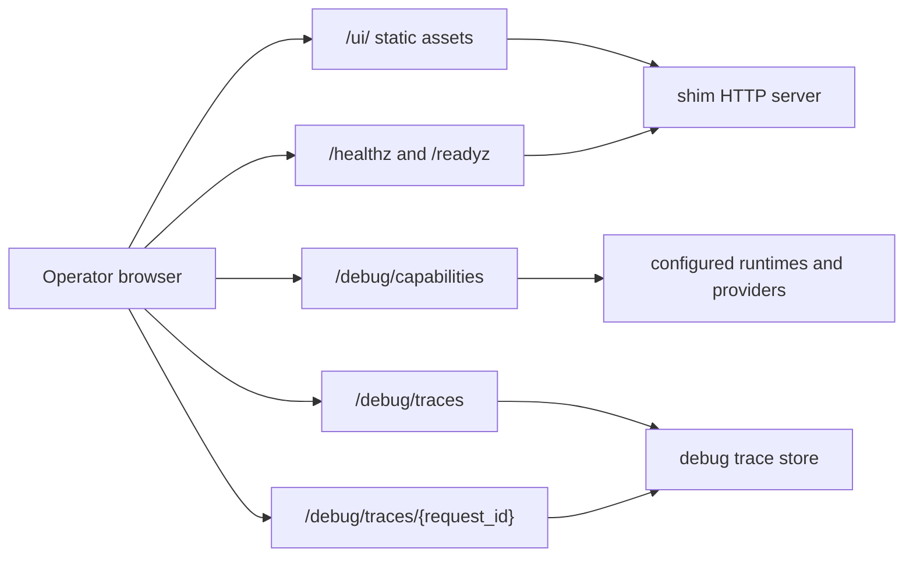

# V4 Read-Only Operator UI

Last updated: May 9, 2026.

Status: first implementation slice.

This document scopes a small read-only web UI for local and private operator
use. It is a shim-owned V4 operational surface, not an OpenAI API compatibility
surface and not a product portal.

## References Reviewed

The UI itself does not change the OpenAI wire contract. The references below
were reviewed because the UI will display OpenAI-facing routing state and must
not overclaim compatibility.

- Local official docs index: [openapi/llms.txt](../openapi/llms.txt)
- OpenAI docs MCP pages reviewed on May 9, 2026:
  - [Migrate to the Responses API](https://developers.openai.com/api/docs/guides/migrate-to-responses)
  - [Streaming API responses](https://developers.openai.com/api/docs/guides/streaming-responses)
  - [Production best practices](https://developers.openai.com/api/docs/guides/production-best-practices)
  - [Rate limits](https://developers.openai.com/api/docs/guides/rate-limits)
  - [Data controls in the OpenAI platform](https://developers.openai.com/api/docs/guides/your-data)
- Final official-site spot-checks on May 9, 2026:
  - [Solid TypeScript configuration](https://docs.solidjs.com/configuration/typescript)
  - [Solid quick start](https://docs.solidjs.com/quick-start)
  - [SvelteKit Node adapter](https://svelte.dev/docs/kit/adapter-node)
  - [SvelteKit hooks](https://svelte.dev/docs/kit/hooks)

OpenAI endpoint discovery through the docs MCP confirmed that `/responses`,
`/responses/input_tokens`, `/responses/compact`,
`/responses/{response_id}`, `/responses/{response_id}/cancel`,
`/responses/{response_id}/input_items`, `/conversations`,
`/conversations/{conversation_id}`,
`/conversations/{conversation_id}/items`, `/chat/completions`, and stored
Chat Completions routes are official OpenAI API paths. This UI must describe
the shim's implementation state conservatively and defer compatibility labels
to [compatibility-matrix.md](compatibility-matrix.md).

## Goal

Provide a fast, pleasant, dependency-light way to inspect the running shim:

- readiness and component health
- active Responses mode and upstream transport
- enabled local tools and proxy-only boundaries
- provider/model routing configuration
- storage, retrieval, compaction, memory, and ops capability state
- recent metadata-only debug traces

The UI should reduce time spent jumping between logs, config, README sections,
and raw JSON responses. It should not become an admin portal.

## Non-Goals

- No editing of `config.yaml`.
- No destructive actions such as purge, backup restore, delete, or vacuum.
- No billing, users, organizations, projects, or customer API keys.
- No OpenAPI changes.
- No new OpenAI-compatible request or response semantics.
- No raw prompt, response body, file content, provider token, or request header
  display.
- No claim stronger than [compatibility-matrix.md](compatibility-matrix.md).

## Stack

Use SolidJS, Vite, and TypeScript for the embedded UI.

Rationale:

- Solid keeps React-like component ergonomics and JSX without bringing React
  runtime behavior.
- The app can remain a simple static bundle served by the Go binary.
- TypeScript is useful for the nested `/debug/capabilities` and
  `/debug/traces` payloads.
- Vite keeps local development fast and does not impose a server framework at
  runtime.

Do not use SolidStart for the embedded operator UI. Server routing, SSR, and
form actions are product-portal concerns, not necessary for this local console.

## Placement

Proposed repo layout:

```text
web/operator-ui/
  index.html
  package.json
  tsconfig.json
  vite.config.ts
  src/
    main.tsx
    App.tsx
    api.ts
    types.ts
    styles.css

internal/httpapi/ui.go
```

The production build should emit static assets that are embedded into the shim
binary with `go:embed` and served under `/ui/`.

The Go runtime must not require Node.js. Node is a build-time dependency only.

## Runtime Shape



The UI should fetch existing shim-owned endpoints:

| Endpoint | Use |
| --- | --- |
| `/healthz` | process liveness |
| `/readyz` | storage, upstream, retrieval, web search, image backend readiness |
| `/debug/capabilities` | main manifest for surface, runtime, tool, backend, plugin, and probe state |
| `/debug/traces?limit=N` | recent metadata-only request list |
| `/debug/traces/{request_id}` | detailed metadata-only routing trace |
| `/metrics` | optional link-out only; do not parse Prometheus text in the first slice |

## Auth Model

The first slice should keep UI assets separate from data access:

- `/ui/` may serve static HTML/CSS/JS without bearer auth when the UI is
  enabled.
- Data endpoints keep the existing auth behavior.
- If `shim.auth.mode=static_bearer`, the UI asks the operator for a bearer
  token and sends it in `Authorization` headers for JSON fetches.
- Store that token only in memory by default. A "remember in this tab" option
  may use `sessionStorage`; do not use `localStorage` by default.
- Do not add cookie auth or login flows to the embedded UI. Those belong in
  the separate portal/control-plane project.

This avoids the direct-browser problem where a protected HTML route cannot be
opened with a custom `Authorization` header, while still keeping the actual
operator data behind the existing auth middleware.

If this feels too permissive for a deployment, keep `ui.enabled=false` and serve
the console through a private reverse proxy that injects auth.

## Config

Add a small config section only when implementation starts:

```yaml
ui:
  enabled: false
  base_path: /ui/
  public_static_assets: true
```

Defaults should be conservative:

- disabled by default for production-style deployments
- enabled by devstack or explicit local config
- no effect on `/v1/*`, `/debug/*`, `/healthz`, `/readyz`, or `/metrics`

## Information Architecture

The UI is an operator workspace, not a landing page.

### Overview

Show the highest-value state in one dense screen:

- process health and readiness
- `responses.mode`
- `responses.upstream_transport`
- persistence backend
- provider/model count
- enabled local runtimes
- debug traces enabled/disabled
- rate limit enabled/disabled
- metrics path if enabled

Use restrained status colors:

- green: ready/enabled/implemented
- amber: broad subset, degraded, fallback, or warning
- red: unready/error/rejected
- gray: disabled, proxy-only, not configured, or out of scope

### Capabilities

Render `/debug/capabilities` as structured operator state, not raw JSON first:

- Surfaces: Responses, Conversations, Chat Completions, Files, Vector Stores,
  Containers
- Runtime: compaction, memory, constrained decoding, Codex, provider routing,
  persistence, retrieval, ops
- Tools: file search, web search, image generation, computer, code
  interpreter, shell, apply patch, MCP server URL, MCP connector ID,
  hosted tool search, client tool search
- Backends and plugins: capability class, readiness, owner, plugin id,
  issues
- Probes: ready/unready plus short error text

Every compatibility badge should link back to
[compatibility-matrix.md](compatibility-matrix.md) or show a local note that
the UI is only reflecting runtime capability state.

### Traces

Provide a trace table and a detail drawer:

- request id
- client request id
- method/path/route
- surface and source format
- model/provider/public model/upstream model
- final status
- duration
- selected backend
- backend projection class
- replay and stream transformer class
- fallback decision
- backend failure decision
- tool decisions
- request cleanup transforms
- rate-limit decision

Do not display request bodies, response bodies, prompt text, output text,
headers, files, or tokens. The trace redaction policy is currently
`metadata_only_no_prompts_no_headers_no_file_contents`; the UI must keep that
boundary visible.

### Routing

Summarize provider routing from the capabilities manifest:

- provider ids
- plugin ids
- public model aliases
- upstream transport mode
- configured model count
- Codex model metadata count

Do not show bearer token env names as clickable secrets. Redacted secret refs
may be shown as labels only if the manifest already exposes them.

### Links

Provide repo-doc links for operator context:

- [compatibility-matrix.md](compatibility-matrix.md)
- [v2-scope.md](v2-scope.md)
- [v3-scope.md](v3-scope.md)
- [v4-scope.md](v4-scope.md)
- [v5-scope.md](v5-scope.md)
- [engineering/openai-api-choreography-atlas.md](engineering/openai-api-choreography-atlas.md)
- [guides/operations.md](guides/operations.md)

In the embedded static UI these can be rendered as plain path labels unless a
doc-serving route exists later.

## UX Direction

Use a quiet, dense, modern ops surface:

- left navigation with sections
- top status strip with health, readiness, mode, and storage
- main content area optimized for tables and inspector drawers
- no hero section
- no decorative dashboard-card mosaic
- no gradients as the main visual identity
- no marketing copy
- small, consistent status badges
- monospaced request ids and model ids
- responsive layout that remains usable at laptop widths

The first screen should be useful without scrolling.

## Type Strategy

Keep explicit TypeScript types in `web/operator-ui/src/types.ts` that mirror the
current JSON payloads:

- `CapabilityManifest`
- `CapabilitySurfaceSet`
- `CapabilityRuntimeConfig`
- `CapabilityToolSet`
- `CapabilityProbeSet`
- `DebugTrace`

Do not add a code generator in the first slice. The manifest is operator-only
and should evolve deliberately with tests. If drift becomes frequent, add a
small JSON fixture test before introducing generation.

## Implemented Slice

The first implementation is intentionally read-only and local/private:

- `web/operator-ui` contains a SolidJS, Vite, and TypeScript app.
- `make operator-ui-build` emits the production bundle into
  `internal/httpapi/operator_ui_dist`.
- The Go binary embeds that bundle and serves it under `ui.base_path`.
- `ui.enabled=false` by default; devstack can enable it explicitly.
- `/debug/capabilities.runtime.ops.operator_ui` advertises enabled state,
  base path, and static-asset auth policy.
- Static assets may be public when `ui.public_static_assets=true`.
- JSON data fetches still use existing endpoints and existing auth/rate-limit
  behavior; `/debug/*` is not made public by the UI.

Configure:

```yaml
ui:
  enabled: true
  base_path: /ui/
  public_static_assets: true
```

Open the console at:

```text
http://127.0.0.1:8080/ui/
```

With `shim.auth.mode=static_bearer`, the UI asks for a bearer token and sends
it only on JSON requests. If `ui.public_static_assets=false`, a plain browser
cannot open `/ui/` without a reverse proxy or browser extension that injects
the `Authorization` header.

## Build And Serve Plan

Implementation sequence:

1. Add `web/operator-ui` with SolidJS, Vite, TypeScript, and static CSS.
2. Implement fetch helpers with bearer-token injection and clear error states.
3. Build Overview, Capabilities, and Traces screens.
4. Add `internal/httpapi/ui.go` with `go:embed` static serving under `/ui/`.
5. Add config wiring for `ui.enabled`.
6. Exempt `/ui/` static assets from bearer auth only when `ui.enabled=true`.
7. Add focused HTTP tests for disabled UI, enabled UI, and auth-protected JSON
   fetch behavior.
8. Add a browser smoke test that opens `/ui/`, loads capabilities, opens a trace
   detail when traces are enabled, and checks for console errors.

## Acceptance Criteria

- `GET /ui/` serves the embedded app only when enabled.
- `GET /ui/` does not change any `/v1/*` route behavior.
- Static UI assets do not expose secrets or runtime config beyond what the JS
  can fetch from existing JSON endpoints.
- `/debug/capabilities` and `/debug/traces` remain the source of truth.
- The UI does not invent compatibility labels beyond the compatibility matrix.
- With static bearer auth enabled, JSON data fetches require a valid bearer
  token.
- With debug traces disabled, the Traces screen explains that tracing is off
  using the capabilities manifest.
- The app has useful loading, empty, error, and unauthorized states.
- Text and controls fit at common desktop and tablet widths.

## Test Plan

Minimum verification for the first implementation:

```bash
npm --prefix web/operator-ui run build
go test ./internal/httpapi
go test ./...
make lint
git diff --check
```

Browser smoke:

- start the shim with `ui.enabled=true`
- open `/ui/`
- verify Overview loads from `/debug/capabilities`
- trigger at least one `/v1/responses` request in a test fixture when debug
  traces are enabled
- verify the trace appears and the detail drawer contains only metadata fields
- check browser console errors

## Future Work

Useful later additions:

- trace filters by surface, status, provider, model, route, and backend class
- time-window refresh and pause controls
- diff view between two capability snapshots
- doc route for local markdown rendering
- live readiness poll with backoff
- optional link to the external portal when configured

Keep these read-only unless the project explicitly decides to add a separate
authenticated admin surface.
